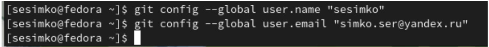
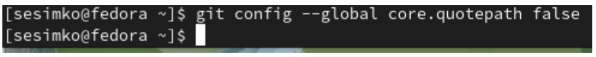
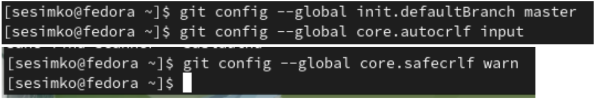
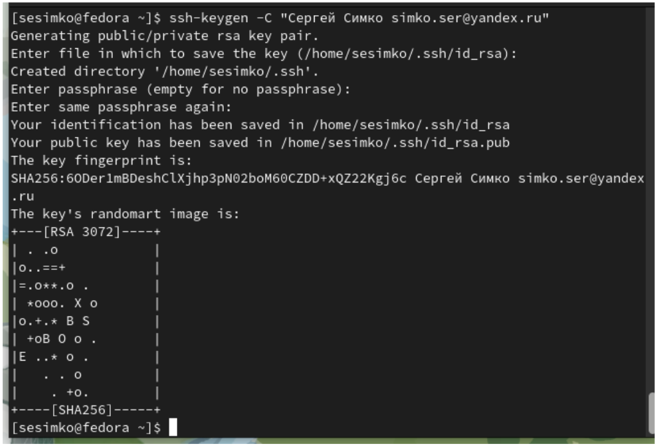
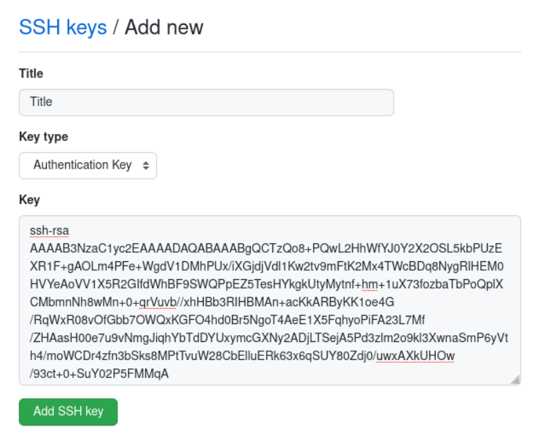
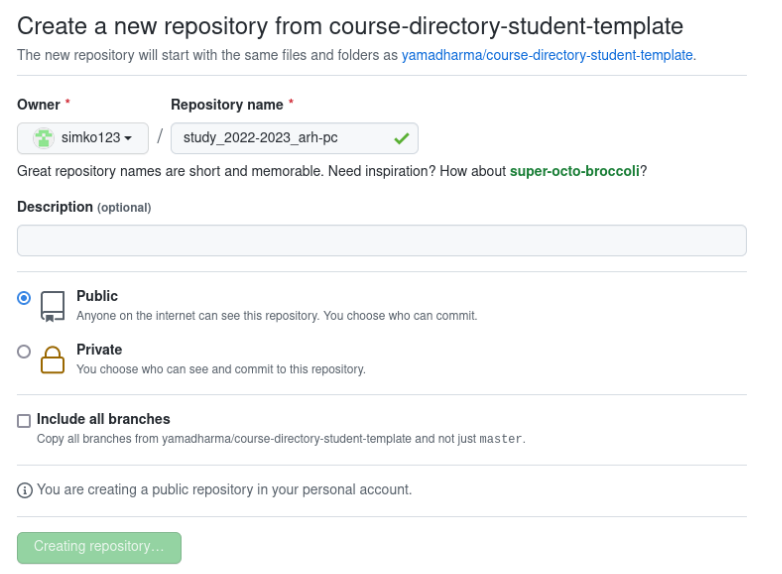
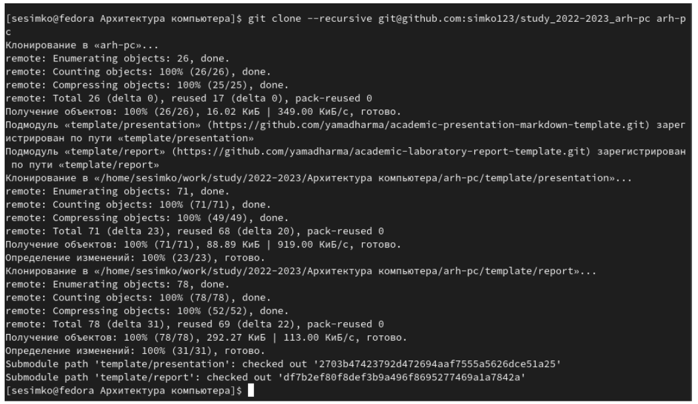
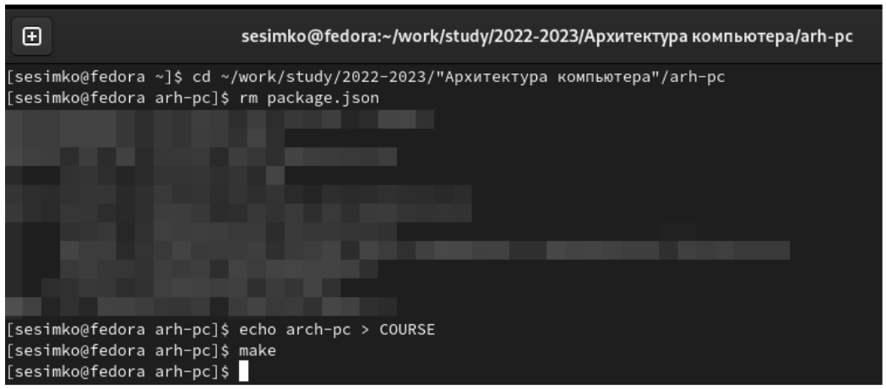
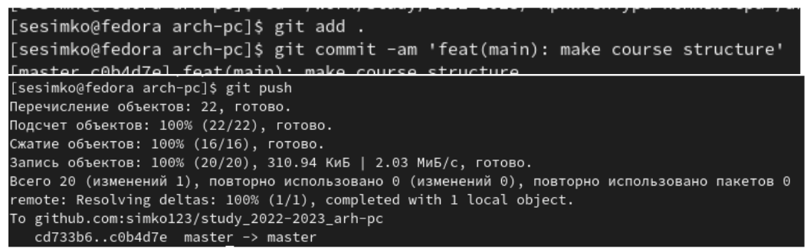
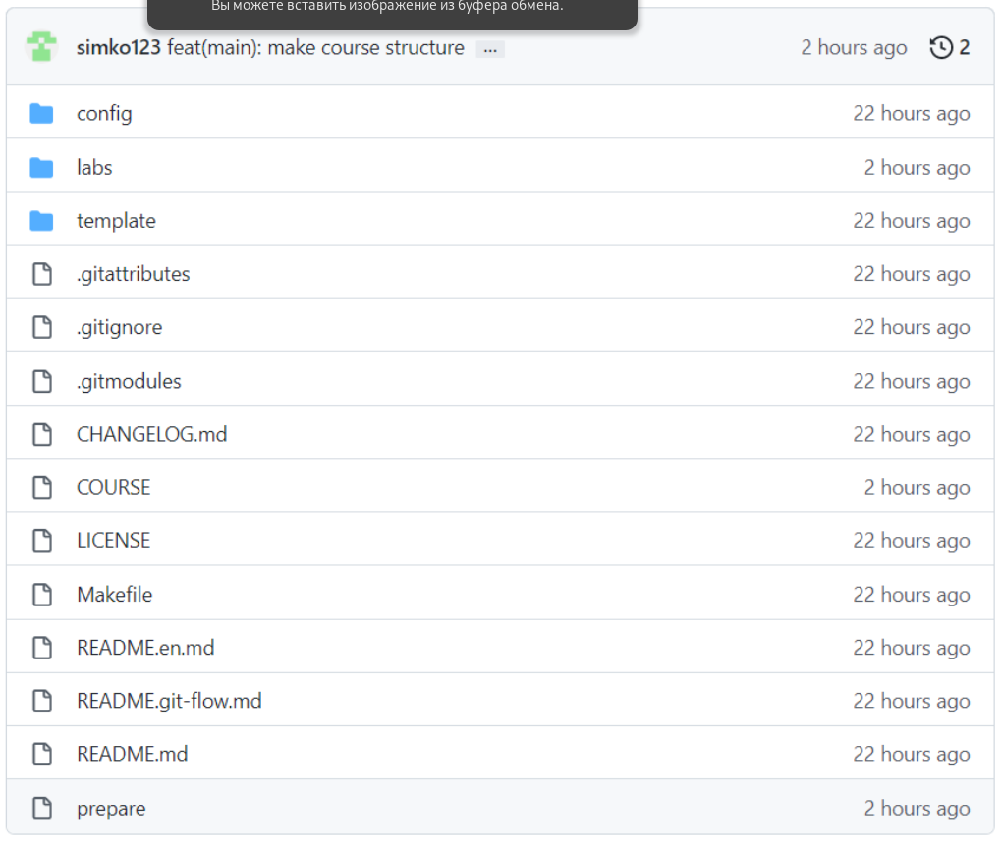

---
## Front matter
title: "Отчет по лабораторной работе 3"
subtitle: "Система контроля версий Git"
author: "Симко Сергей Евгеньевич"

## Generic otions
lang: ru-RU
toc-title: "Содержание"

## Bibliography
bibliography: bib/cite.bib
csl: pandoc/csl/gost-r-7-0-5-2008-numeric.csl

## Pdf output format
toc: true # Table of contents
toc-depth: 2
lof: true # List of figures
lot: true # List of tables
fontsize: 12pt
linestretch: 1.5
papersize: a4
documentclass: scrreprt
## I18n polyglossia
polyglossia-lang:
  name: russian
  options:
	- spelling=modern
	- babelshorthands=true
polyglossia-otherlangs:
  name: english
## I18n babel
babel-lang: russian
babel-otherlangs: english
## Fonts
mainfont: PT Serif
romanfont: PT Serif
sansfont: PT Sans
monofont: PT Mono
mainfontoptions: Ligatures=TeX
romanfontoptions: Ligatures=TeX
sansfontoptions: Ligatures=TeX,Scale=MatchLowercase
monofontoptions: Scale=MatchLowercase,Scale=0.9
## Biblatex
biblatex: true
biblio-style: "gost-numeric"
biblatexoptions:
  - parentracker=true
  - backend=biber
  - hyperref=auto
  - language=auto
  - autolang=other*
  - citestyle=gost-numeric
## Pandoc-crossref LaTeX customization
figureTitle: "Рис."
tableTitle: "Таблица"
listingTitle: "Листинг"
lofTitle: "Список иллюстраций"
lotTitle: "Список таблиц"
lolTitle: "Листинги"
## Misc options
indent: true
header-includes:
  - \usepackage{indentfirst}
  - \usepackage{float} # keep figures where there are in the text
  - \floatplacement{figure}{H} # keep figures where there are in the text
---

# Цель работы

Целью работы является изучить идеологию и применение средств контроля
версий. Приобрести практические навыки по работе с системой git.

# Выполнение лабораторной работы

Настроим имя пользователя и почту

{fig:fig001 width = 70%}

Настроим utf-8 в выводе сообщений гит.

{fig:fig002 width = 70%}

Зададим начальную ветку master и параметры autocrlf, selfcrlf

{fig:fig003 width = 70%}

Создаем ssh-ключ.

{fig:fig004 width = 70%}

Теперь нам нужно ввести ключ в github.

{fig:fig005 width = 70%}

Создаем репозиторий по заданному шаблону

{fig:fig006 width = 70%}

Клонируем репозиторий в директорию arh-pc

{fig:fig007 width = 70%}

Удаляем ненужные файлы и создаем нужные.

{fig:fig008 width = 70%}

Отправляем файлы на сервер

{fig:fig009 width = 70%}

Мы можем удостовериться, что все прошло как надо, проверив отсутствие файла package.json и наличие COURSE в репозитории.

{fig:fig010 width = 70%}
# Выводы

Мы научились пользоваться VCS Git

