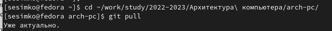
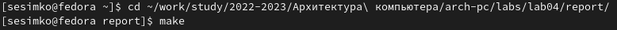
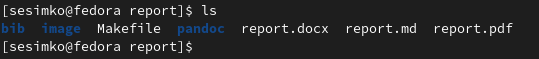
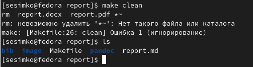
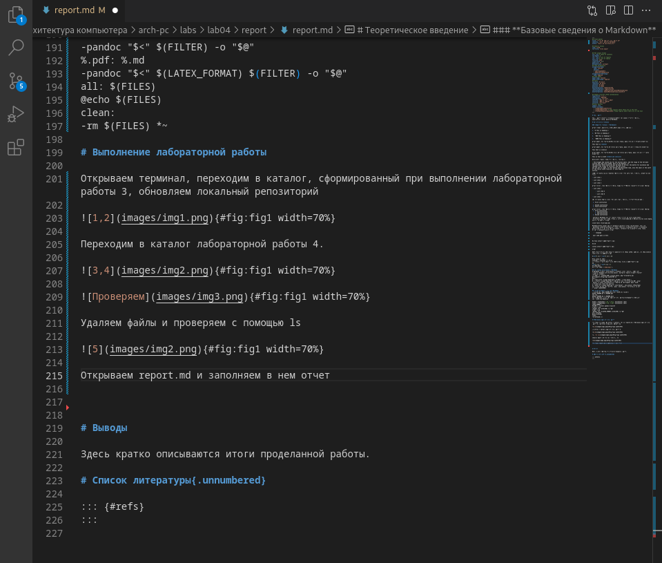

---
## Front matter
title: "Отчет по лабораторной работе №4"
subtitle: "Язык разметки Markdown"
author: "Симко Сергей Евгеньевич"

## Generic otions
lang: ru-RU
toc-title: "Содержание"

## Pdf output format
toc: true # Table of contents
toc-depth: 2
lof: true # List of figures
lot: true # List of tables
fontsize: 12pt
linestretch: 1.5
papersize: a4
documentclass: scrreprt
## I18n polyglossia
polyglossia-lang:
  name: russian
  options:
	- spelling=modern
	- babelshorthands=true
polyglossia-otherlangs:
  name: english
## I18n babel
babel-lang: russian
babel-otherlangs: english
## Fonts
mainfont: PT Serif
romanfont: PT Serif
sansfont: PT Sans
monofont: PT Mono
mainfontoptions: Ligatures=TeX
romanfontoptions: Ligatures=TeX
sansfontoptions: Ligatures=TeX,Scale=MatchLowercase
monofontoptions: Scale=MatchLowercase,Scale=0.9

## Pandoc-crossref LaTeX customization
figureTitle: "Рис."
tableTitle: "Таблица"
listingTitle: "Листинг"
lofTitle: "Список иллюстраций"
lotTitle: "Список таблиц"
lolTitle: "Листинги"
## Misc options
indent: true
header-includes:
  - \usepackage{indentfirst}
  - \usepackage{float} # keep figures where there are in the text
  - \floatplacement{figure}{H} # keep figures where there are in the text
---

# Цель работы

Целью работы является освоение процедуры оформления отчетов с помощью
легковесного языка разметки Markdown.

# Выполнение лабораторной работы

Открываем терминал, переходим в каталог, сформированный при выполнении лабораторной работы 3, обновляем локальный репозиторий

{#fig:fig001 width=70%}

Переходим в каталог лабораторной работы 4.

{#fig:fig002 width=70%}

{#fig:fig003 width=70%}

Удаляем файлы и проверяем с помощью ls

{#fig:fig004 width=70%}

Открываем report.md и заполняем в нем отчет 

{#fig:fig005 width=70%}

Отгружаем на Github. (если вы это читаете, он на месте)

# Выводы

Мы освоили процедуры оформления отчетов с помощью markdown

