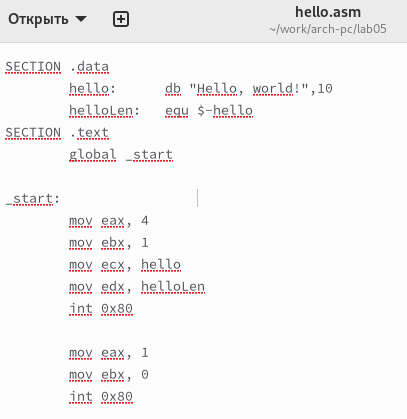
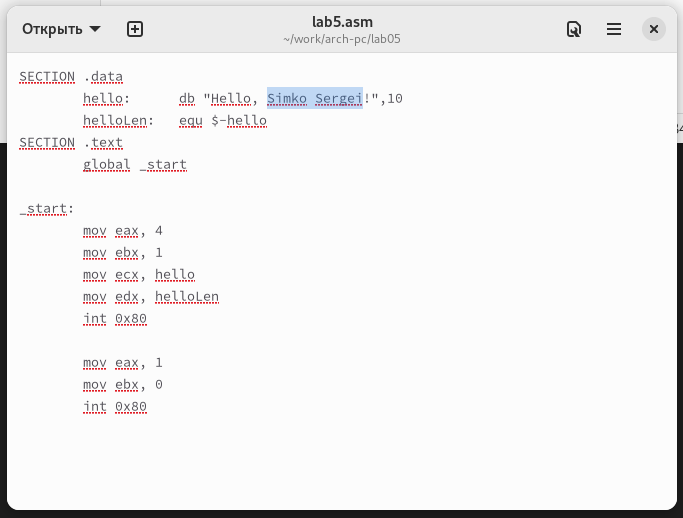

---
## Front matter
title: "Отчет по лабораторной работе 5"
subtitle: "Создание и
процесс обработки программ на языке
ассемблера NASM"
author: "Симко Сергей Евгеньевич"

## Generic otions
lang: ru-RU
toc-title: "Содержание"

## Pdf output format
toc: true # Table of contents
toc-depth: 2
lof: true # List of figures
lot: true # List of tables
fontsize: 12pt
linestretch: 1.5
papersize: a4
documentclass: scrreprt
## I18n polyglossia
polyglossia-lang:
  name: russian
  options:
	- spelling=modern
	- babelshorthands=true
polyglossia-otherlangs:
  name: english
## I18n babel
babel-lang: russian
babel-otherlangs: english
## Fonts
mainfont: PT Serif
romanfont: PT Serif
sansfont: PT Sans
monofont: PT Mono
mainfontoptions: Ligatures=TeX
romanfontoptions: Ligatures=TeX
sansfontoptions: Ligatures=TeX,Scale=MatchLowercase
monofontoptions: Scale=MatchLowercase,Scale=0.9
## Pandoc-crossref LaTeX customization
figureTitle: "Рис."
tableTitle: "Таблица"
listingTitle: "Листинг"
lofTitle: "Список иллюстраций"
lotTitle: "Список таблиц"
lolTitle: "Листинги"
## Misc options
indent: true
header-includes:
  - \usepackage{indentfirst}
  - \usepackage{float} # keep figures where there are in the text
  - \floatplacement{figure}{H} # keep figures where there are in the text
---

# Цель работы

Освоение процедуры компиляции и сборки программ, написанных на ассем-
блере NASM.

# Выполнение лабораторной работы

Создаем директорию для работы с .asm файлами, перемещаемся в нее и создаем
файл hello.asm

{fig:fig001 width = 70%}

С помощью текстового редактора пишем наш "Hello world!"

{fig:fig002 width = 70%}

Компилируем программу в hello.o и проверяем результат

{fig:fig003 width = 70%}

Компилируем программу в obj.o и файл листинга list.lst

{fig:fig004 width = 70%}

Передаем объектный файл на обработку компоновщику и проверяем, что исполняемый файл hello создан

{fig:fig005 width = 70%}

Таким же образом создаем исполняемый файл main из файла obj.o

{fig:fig006 width = 70%}

Пробуем запустить наши исполняемые файлы. Как видим, все прошло отлично.

{fig:fig007 width = 70%}

Создаем копию hello.asm с названием lab5.asm

{fig:fig008 width = 70%}

Вносим необходимые изменения в новый файл

{fig:fig009 width = 70%}

Транслируем lab5.asm в объектный файл

{fig:fig010 width = 70%}

Затем компонуем в исполняемый файл

{fig:fig011 width = 70%}

Запускаем

{fig:fig012 width = 70%}

# Выводы

Мы освоили процедуру компиляции и сборки программ, написанных на ассем-
блере NASM.

