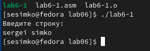

---
## Front matter
title: "Отчет по лабораторной работе 6"
subtitle: "Основы работы с midnight commander. Структура программы на языке ассемблера NASM"
author: "Симко Сергей Евгеньевич"

## Generic otions
lang: ru-RU
toc-title: "Содержание"

## Pdf output format
toc: true # Table of contents
toc-depth: 2
lof: true # List of figures
lot: true # List of tables
fontsize: 12pt
linestretch: 1.5
papersize: a4
documentclass: scrreprt
## I18n polyglossia
polyglossia-lang:
  name: russian
  options:
	- spelling=modern
	- babelshorthands=true
polyglossia-otherlangs:
  name: english
## I18n babel
babel-lang: russian
babel-otherlangs: english
## Fonts
mainfont: PT Serif
romanfont: PT Serif
sansfont: PT Sans
monofont: PT Mono
mainfontoptions: Ligatures=TeX
romanfontoptions: Ligatures=TeX
sansfontoptions: Ligatures=TeX,Scale=MatchLowercase
monofontoptions: Scale=MatchLowercase,Scale=0.9
## Pandoc-crossref LaTeX customization
figureTitle: "Рис."
tableTitle: "Таблица"
listingTitle: "Листинг"
lofTitle: "Список иллюстраций"
lotTitle: "Список таблиц"
lolTitle: "Листинги"
## Misc options
indent: true
header-includes:
  - \usepackage{indentfirst}
  - \usepackage{float} # keep figures where there are in the text
  - \floatplacement{figure}{H} # keep figures where there are in the text
---

# Цель работы

Приобретение практических навыков работы с midnight commander. Освоение инструций языка ассемблера mov и int

# Выполнение лабораторной работы

{ #fig:001 width=70% }
Открываем mc

{ #fig:002 width=70% }
Создаем в каталоге с программами из прошлой лабораторной каталог lab06

{ #fig:003 width=70% }
Командой touch создаем файл lab6-1.asm

{ #fig:004 width=70% }
Пишем код из лабораторной работы и собираем в исполняемый файл

{ #fig:005 width=70% }
Проверяем работу программы

{ #fig:006 width=70% }
Устанавливаем файл in_out.asm

{ #fig:007 width=70% }
Делаем копию первого .asm файла

{ #fig:008 width=70% }
Переделываем программу с новыми функциями

{ #fig:009 width=70% }
Собираем файл

{ #fig:010 width=70% }
Делаем новый .asm файл

{ #fig:011 width=70% }
Пишем программу, которая запрашивает строку, а затем выводит ее в консоль

{ #fig:012 width=70% }
собираем

{ #fig:013 width=70% }
Проверяем работу

{ #fig:014 width=70% }
Делаем новый файл, делающий то же самое, но с функциями из in_out

{ #fig:015 width=70% }
проверяем работу

# Выводы

Мы обрели навыки пользования midnight commander и изучили инструкции mov и int на ассемблере nasm.