---
## Front matter
title: "Отчет по лабораторной работе 6"
subtitle: "Основы работы с midnight commander. Структура программы на языке ассемблера NASM"
author: "Симко Сергей Евгеньевич"

## Generic otions
lang: ru-RU
toc-title: "Содержание"

## Pdf output format
toc: true # Table of contents
toc-depth: 2
lof: true # List of figures
lot: true # List of tables
fontsize: 12pt
linestretch: 1.5
papersize: a4
documentclass: scrreprt
## I18n polyglossia
polyglossia-lang:
  name: russian
  options:
	- spelling=modern
	- babelshorthands=true
polyglossia-otherlangs:
  name: english
## I18n babel
babel-lang: russian
babel-otherlangs: english
## Fonts
mainfont: PT Serif
romanfont: PT Serif
sansfont: PT Sans
monofont: PT Mono
mainfontoptions: Ligatures=TeX
romanfontoptions: Ligatures=TeX
sansfontoptions: Ligatures=TeX,Scale=MatchLowercase
monofontoptions: Scale=MatchLowercase,Scale=0.9
## Pandoc-crossref LaTeX customization
figureTitle: "Рис."
tableTitle: "Таблица"
listingTitle: "Листинг"
lofTitle: "Список иллюстраций"
lotTitle: "Список таблиц"
lolTitle: "Листинги"
## Misc options
indent: true
header-includes:
  - \usepackage{indentfirst}
  - \usepackage{float} # keep figures where there are in the text
  - \floatplacement{figure}{H} # keep figures where there are in the text
---

# Цель работы

Освоение арифметических инструкций языка ассемблера NASM.

# Выполнение лабораторной работы

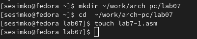{ #fig:001 width=60% }
Создаем директорию для нашей лаб. работы и в ней создаем .asm файл.

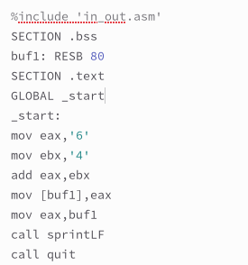{ #fig:002 width=60% }
Пишем код.

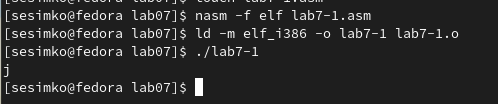{ #fig:003 width=60% }
Собираем и запускаем.

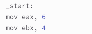{ #fig:004 width=60% }
Заменяем в коде символы на числа.

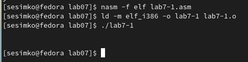{ #fig:005 width=60% }
Снова собираем и запускаем. 

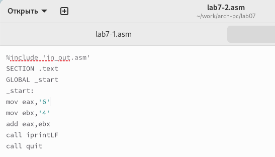{ #fig:006 width=60% }
Создаем новый .asm и пишем в него код.

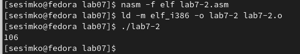{ #fig:007 width=60% }
Собираем и запускаем.

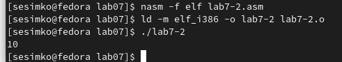{ #fig:008 width=60% }
Заменив символы на числа, наконец, получаем интересующий нас результат!

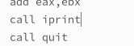{ #fig:009 width=60% }
Заменяем в программе функцию iprintLF на iprint

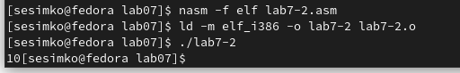{ #fig:010 width=60% }
Теперь вывод отличается от предыдущего, в нем нет переноса строки.

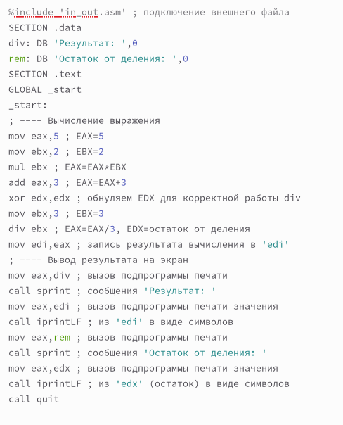{ #fig:011 width=60% }
Пишем новую программу.

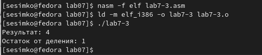{ #fig:012 width=60% }
Собираем и запускаем. Результат соответствует ожидаемому.

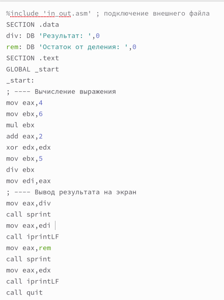{ #fig:013 width=60% }
Немного меняем формулу.

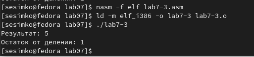{ #fig:014 width=60% }
Получаем новый результат.

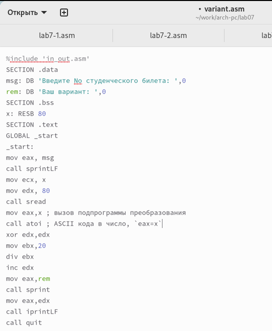{ #fig:015 width=60% }
Пишем программу генерации варианта на основе номера студ. билета.

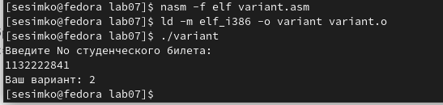{ #fig:016 width=60% }
Собираем и запускаем. Посчитав вручную, удостоверяемся, что результат правильный.

# Ответы на вопросы

1. Первые две строки во входной функции.
2. Инструкции отвечают за ввод студ. билета.
3. Для преобразования ASCII в число (aSCII to iNTEGER).
4. xor edx,edx; mov ebx,20; div ebx; inc edx
5. edx
6. Прибавить к значению в edx единицу.
7. mov eax,rem; call sprint; mov eax,edx; call iprintLF

# Самостоятельная работа

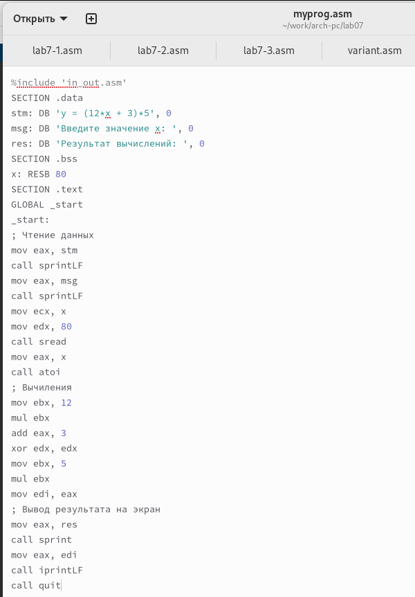{ #fig:017 width=60% }
Пишем программу

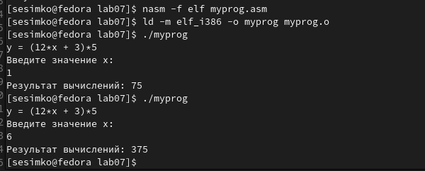{ #fig:018 width=60% }
Проверяем результат для интересующих значений

# Выводы

Мы изучили арифметические операции в nasm.